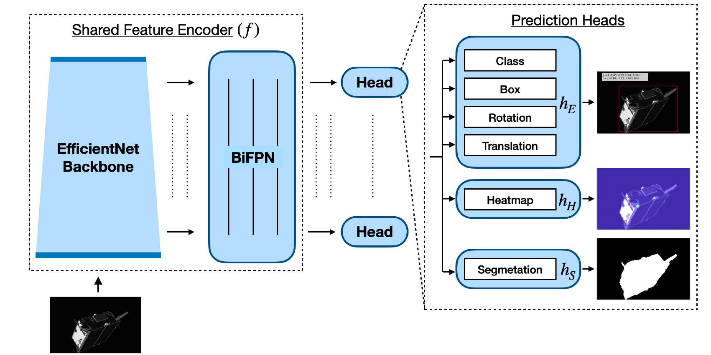

# Satellite PE MTL

## Introduction

6D pose estimation is the problem of detecting the position of a 3D object, which includes its location and orientation. Recently, this problem has become more noticeable in pose estimation for noncooperative spacecraft to find the position of spacecraft according to a monocular-based camera. Using Monocular-based pose estimation in spacecraft brings the possibility of facing several issues such as the refueling of space assets, active debris removal, and spacecraft docking.
Using Convolutional Neural Networks (CNN) has recently become more prevalent in solving the pose estimation problem. Therefore, European Space Agency (ESA), with cooperation from the Space Rendezvous Laboratory (SLAB), released a dataset known as SPEED, which contains different pictures of Tango spacecraft in different positions. This dataset is used for Pose Estimation Challenge 2019.
Moreover, Multi-task learning is a recent method in computer vision, which able us to train a model which is able to do several tasks such as classification, segmentation, or detection using several heads and a part of shared parameters. In addition, the loss of each head can backpropagate to improve the overall performance of shared parameters. As a result, Using this idea, Park et al. [1] introduce a multi-modal method to face pose estimation of monocular-based noncooperative spacecraft using several heads to do the segmentation, pose estimation, and heatmap calculation.

## Data Locations
In order to run the code add Dataset and related files to the following locations in the root directory:

Data Directory: Datasets/speed/synthetic/

Data are available from this [link](https://zenodo.org/record/6327547#.Yxn6iHbP23A).

Mask Data Location: Datasets/speed/synthetic/masks/ 

Key Points: Datasets/speed/synthetic/keypoint3D.mat
(Key Points are available in the materials file)

You can check the complete information related to this project from the following document: [link](https://drive.google.com/file/d/1ECqlb9-cyH2UHYbXarhBRWd2yD_CAqit/view?usp=sharing).

